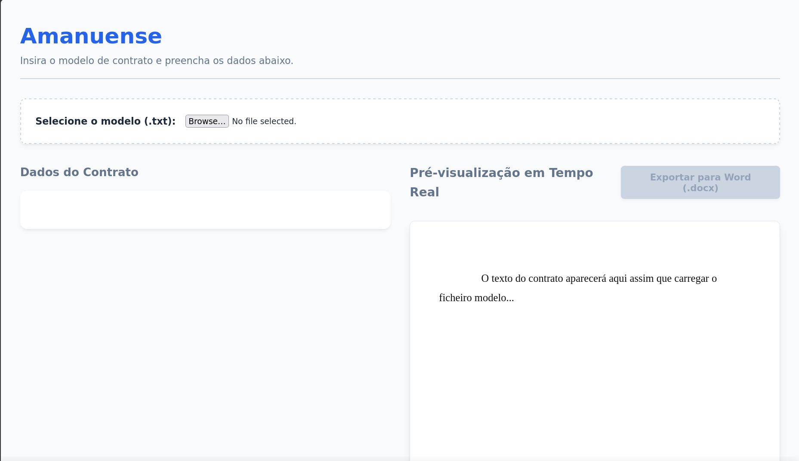

# Amanuense
Amanuense is a semi-automated tool for creating documents. The project sparked from a real-world need of a family member who produces and, consequently, modifies a massive volume of documents in their daily routine.

# Goal
I decided to combine the useful with the agreeable in my life: building a project that can optimize someone's workflow—saving them from unnecessary stress while drafting contracts—and using it as the perfect opportunity to train my programming logic with JavaScript. It focuses on core concepts essential to any language, such as Objects, loops, and DOM manipulation¹.
¹: DOM (Document Object Model) specifically utilized with JS.

While designing the system, I wanted to ensure it was completely dynamic. The idea is that the system should be capable of reading absolutely any document (currently supporting `.txt` files).

# How It Works
Currently, the system operates based on the upload of a `.txt` document (which serves as the template that needs to be filled out).

What's the core idea?
The user uploads a document containing variables—meaning fields that are not fixed. The system reads the entire file and dynamically "creates" input fields based on those variables, allowing the user to type in the exact information they want.

# How to Create a Template
The template must be in `.txt` format, and the variables must follow this specific naming structure: `{{group.field}}`.

Where **group** represents the **entity/object** present in the document, and **field** represents the **characteristics/properties** of that object.
*For those studying programming, this will strongly remind you of SQL concepts in `Data Modeling`.*

Here is an example of a short snippet from a document formatted correctly for the system: 

> We are selling our car, a {{carroVenda.marca}} in the color {{carroVenda.cor}} with license plate {{carroVenda.placa}}. Since it has been our long-time companion, we nicknamed it {{carroVenda.apelido}}.
> The upfront price is R${{carroVenda.valorAvista}}.

# Screenshots

## Home

# Future Improvements
- [ ] Mobile responsiveness.
- [ ] Local/cloud storage for uploaded templates.
- [ ] Exporting to PDF format.
- [ ] Maybe a document version control system?

---

Thank you.
